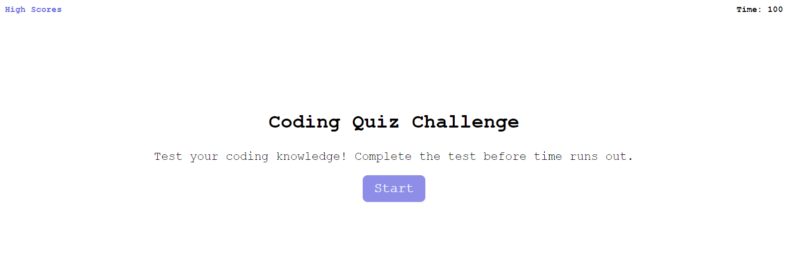

# Coding Quiz

## Installation

N/A

## Usage

Coding quiz deployed link:

GitHub Repo: 

The coding quiz is ready to use upon entering the webpage. The time will be listed in the upper right hand corner of the home page. It will begin decreasing as soon as the quiz is started. You can also access the high score page directly from the home page via the button in the left hand corner labeled "High Scores". Note that the high score page will be empty until the quiz is completed, and that it only tracks your scores for the session.

To begin the quiz hit the "Start" button. Once started, the time will show as decreasing in the upper right hand corner, and a question will appear. Simply clicked on one of the answer options available under the question. If the answer is correct, you will see a green "Correct" appear. If the answer wrong, you will see a red "Wrong" appear, and 10 seconds will be deducted. Clicking one of the choices immediately triggers the advance to the next question. 

At the end of the quiz, you must submit your initials to save your score. Upon doing so, you will be taken to the high score page where your initials and score will be visible. You can also retake the quiz directly from the high score page, or go directly to the home page.

Webpage picture:

## License

MIT License